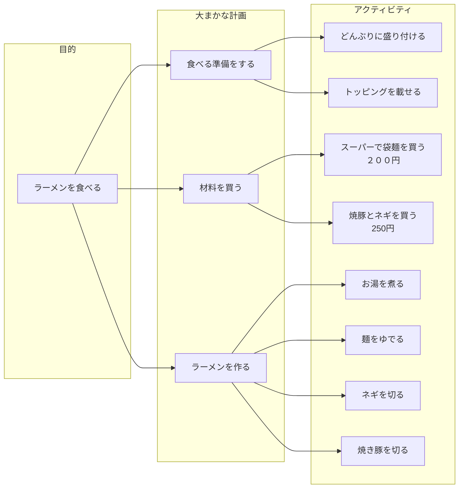

```mermaid
graph LR;
    subgraph 目的
    td1["ラーメンを食べる"]
    end
    td1-->td4
    td1-->td2
    td1-->td3
    subgraph 大まかな計画
    td2["材料を買う"]
    td3["ラーメンを作る"]
    td4["食べる準備をする"]
    end
    subgraph アクティビティ
    td2-->td6
    td2-->td7
    td3-->td8
    td3-->td9


    td4-->td11
    td4-->td10
td3-->td13
td3-->td14

    td6["スーパーで袋麺を買う
    ２００円"]
    td7[" 焼豚とネギを買う
        250円"]


    td8["お湯を煮る"]
    td9["麺をゆでる"]
    td13["ネギを切る"]
    td14["焼き豚を切る"]
    td10["トッピングを載せる"]
    td11["どんぶりに盛り付ける"]
    end


```