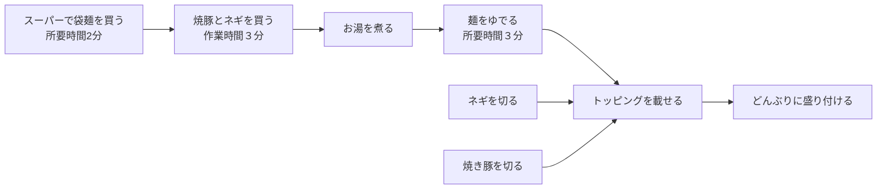

```mermaid
graph LR;
   td1["スーパーで袋麺を買う
   所要時間2分"]

   td2["焼豚とネギを買う
   作業時間３分"]
      td3["お湯を煮る"]
      td4["麺をゆでる
      所要時間３分"]
      td5["トッピングを載せる"]
      td6["どんぶりに盛り付ける"]
      td7["ネギを切る"]
      td8["焼き豚を切る"]

   td1-->td2
   td2-->td3
   td3-->td4
   td4-->td5
   td5-->td6
    td7-->td5
    td8-->td5
```
