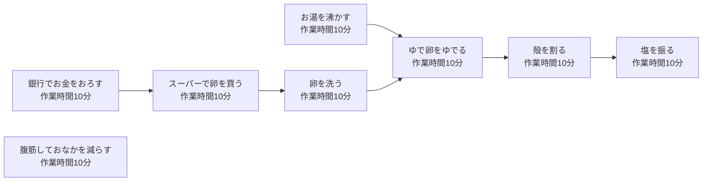

```mermaid
graph LR;
   td1["銀行でお金をおろす
   作業時間10分"]

   td2["スーパーで卵を買う
   作業時間10分"]
      td3["卵を洗う
   作業時間10分"]
      td4["お湯を沸かす
   作業時間10分"]
      td5["ゆで卵をゆでる
   作業時間10分"]
      td6["殻を割る
   作業時間10分"]
      td7["塩を振る
   作業時間10分"]
   td8["腹筋しておなかを減らす
   作業時間10分"]
   td1-->td2
   td2-->td3
   td4-->td5
   td3-->td5
   td5-->td6
   td6-->td7
```