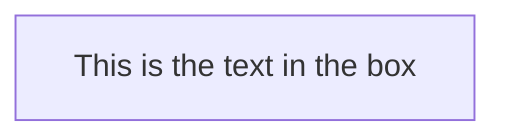
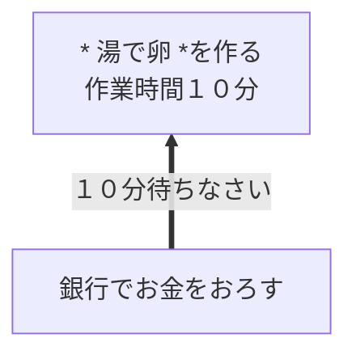
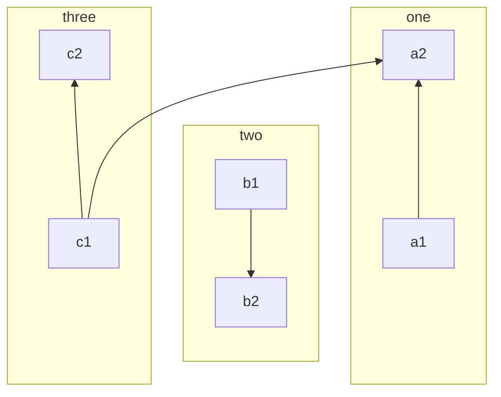

```mermaid
graph TD;
    A-->B;
    A-->C;
    B-->D;
    C-->D;
```

```mermaid
graph TD;
id1[This is the text in the box]
```

```mermaid
graph BT;
td1["銀行でお金をおろす"]

td2["* 湯で卵 *を作る
作業時間１０分"]
td1==１０分待ちなさい==>td2
```

```mermaid
graph BT;

    c1-->a2
    subgraph one
    a1-->a2
    end
    subgraph two
    b1-->b2
    end
    subgraph three
    c1-->c2
    end
```