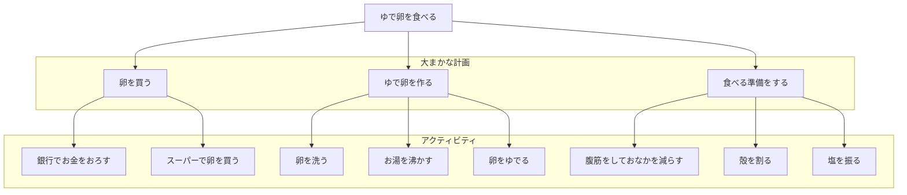

```mermaid
graph TD;
    td1["ゆで卵を食べる"]
    td1-->td2
    td1-->td3
    td1-->td4
    subgraph 大まかな計画
    td2["卵を買う"]
    td3["ゆで卵を作る"]
    td4["食べる準備をする"]
    end
    subgraph アクティビティ
    td2-->td5
    td2-->td6
    td3-->td7
    td3-->td8
    td3-->td9
    td4-->td10
    td4-->td11
    td4-->td12
    td5["銀行でお金をおろす"]
    td6["スーパーで卵を買う"]
    td7["卵を洗う"]
    td8["お湯を沸かす"]
    td9["卵をゆでる"]
    td10["腹筋をしておなかを減らす"]
    td11["殻を割る"]
    td12["塩を振る"]
    end


```